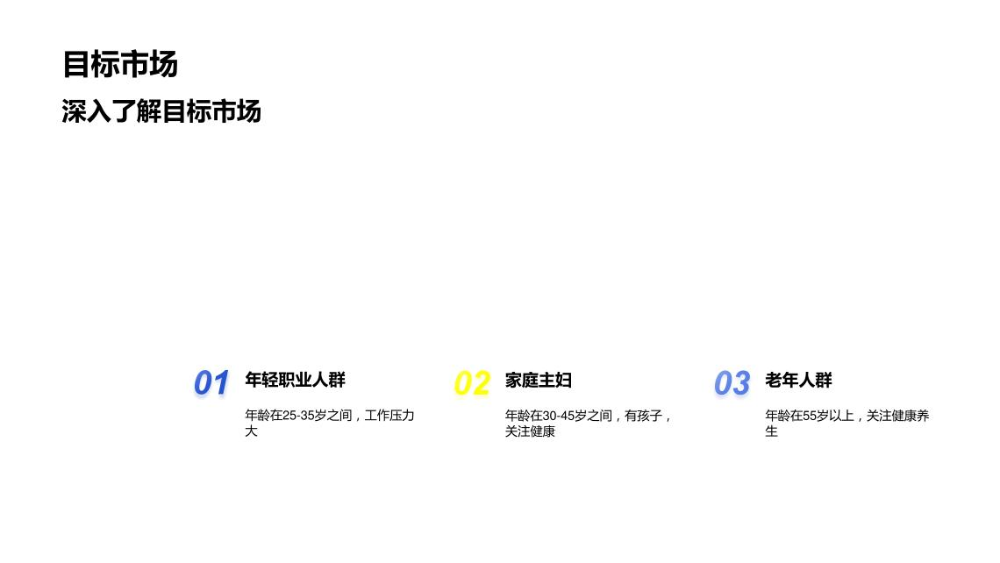

# OCR

A modular multimodal OCR / document parsing repository for structured documents, page layout analysis, HTML rendering, and lightweight evaluation.

This repository focuses on a **locally reproducible OCR pipeline** with explicit stages for:

- layout detection
- OCR text recognition
- relation / reading-order decoding
- table HTML rendering
- proxy scoring and sanity checks

---

## Highlights

- Modular pipeline instead of a black-box parser
- Layout-first parsing with PaddleX / PaddleOCR based runtime
- Table HTML rendering tests and layout detector tests included
- End-to-end sanity check script for real-image inference
- Proxy scorer for fast local iteration
- Datasets included for local debugging and evaluation

---

## Measured Snapshots

Below are **real measured results from the current repository state**.

### Unit Tests

```text
34 tests passed
```

Run with:

```bash
python -m unittest tests.test_layout_detector tests.test_table_html
```

### Single-Image Sanity Check

Observed on one real sample image:

- non-empty output produced
- `blocks_source = layout_detector`
- `blocks_count = 12`
- `tables_count = 0`
- wall time ≈ `39.02s`

This confirms that the pipeline already runs end-to-end and emits structured HTML.

### 5-Image Proxy Evaluation

Command:

```bash
python eval.py \
  --config trainer/config/config.yaml \
  --input /tmp/ocr_eval_5.jsonl \
  --image-root datasets/image/eval \
  --output /tmp/ocr_eval_5_submit.jsonl \
  --debug-output /tmp/ocr_eval_5_debug.jsonl

python scripts/score_proxy.py \
  --gt datasets/label/eval.jsonl \
  --debug /tmp/ocr_eval_5_debug.jsonl
```

Results:

| Metric | Value |
|---|---:|
| Samples | 5 |
| mAP | 0.2360 |
| F1 | 0.4000 |
| Text BLEU proxy (`B_text`) | 0.4766 |
| Formula BLEU proxy (`B_formula`) | 0.0000 |
| Table TEDS proxy (`T_table`) | 0.0000 |
| Reading-order proxy (`K_order`) | 0.6371 |
| **Weighted proxy score** | **0.2699** |

### Runtime Snapshot (5 Images)

| Item | Value |
|---|---:|
| Total runtime | 67.92s |
| Average per image | 13.58s |
| First image (cold start) | 18.74s |
| Subsequent images | ~7.35s to ~7.83s |
| Fallback triggered | 0 / 5 |
| Block source | layout detector for all 5 |

---

## Current Status

### Working

- local inference runs successfully
- layout detector path is active
- OCR enrichment runs successfully
- HTML is produced
- unit tests pass
- proxy scorer works

### Not Yet Strong Enough

- duplicate detections can leak into final HTML
- headings / captions can be over-produced
- formula and table quality are still weak in the current measured slice
- current quality is good enough for iteration, but not yet good enough for a polished parser

In short:

> The pipeline has already crossed the **runs end-to-end** threshold, but it has not yet crossed the **high-quality parser** threshold.

---

## Architecture Overview

```text
Image / Page
   │
   ├─► Layout detector
   │      └─► block candidates
   │
   ├─► OCR enrichment on selected ROIs
   │
   ├─► relation / reading-order decoding
   │
   ├─► optional table / formula processing
   │
   └─► HTML rendering + debug statistics
```

Main entry points:

- `eval.py` — main inference / evaluation entry
- `scripts/sanity_check.py` — end-to-end sanity runner
- `scripts/score_proxy.py` — lightweight proxy scorer
- `scripts/smoke_layout_detector.py` — layout smoke test
- `tests/test_layout_detector.py` — layout detector unit tests
- `tests/test_table_html.py` — table / HTML rendering unit tests

---

## Repository Layout

```text
ocr/
├── datasets/
├── eval.py
├── eval.sh
├── merge_lora.py
├── models/
├── README.md
├── requirements.txt
├── scripts/
├── tests/
├── train.py
├── train.sh
├── trainer/
└── utils/
```

---

## Installation

### Recommended Environment

- Python **3.12**
- Linux
- GPU recommended for practical runtime

### Setup

```bash
git clone https://github.com/Hunryyy/ocr.git
cd ocr
python -m venv .venv
source .venv/bin/activate
pip install -r requirements.txt
```

### Notes on Runtime

The repository does not bundle local virtual environments or runtime caches.

However, after clone, the project can still be made runnable because:
- code is included
- configs are included
- datasets are included
- PaddleX / PaddleOCR can download required official runtime models on first run when network access is available

---

## Quick Start

### 1. Run Unit Tests

```bash
python -m unittest tests.test_layout_detector tests.test_table_html
```

### 2. Run a Sanity Check on One Image

```bash
python scripts/sanity_check.py \
  --config trainer/config/config.yaml \
  --images datasets/image/eval/f850e9fc-a4f8-4393-8f6c-ae6c21abdffc.jpg \
  --output /tmp/sanity_output.jsonl
```

### 3. Run Evaluation via Shell Wrapper

```bash
bash eval.sh
```

By default, `eval.sh` uses:
- `trainer/config/config.yaml`
- `datasets/label/eval.jsonl`
- `datasets/image/eval`

You can also dry-run the wrapper:

```bash
DRY_RUN=1 bash eval.sh
```

You can override them:

```bash
CONFIG_FILE=./trainer/config/config.yaml \
INPUT_DATA=./datasets/label/eval.jsonl \
IMAGE_ROOT=./datasets/image/eval \
RESULT_FILE=./eval_results/results.jsonl \
DEBUG_FILE=./eval_results/debug.jsonl \
PARALLEL=1 \
bash eval.sh
```

### 4. Run the Main Parser Directly

```bash
python eval.py \
  --config trainer/config/config.yaml \
  --input your_input.jsonl \
  --image-root datasets/image/eval \
  --output submit.jsonl \
  --debug-output debug.jsonl
```

### 5. Run Training via Shell Wrapper

```bash
bash train.sh
```

Dry-run the training wrapper before launching a real training job:

```bash
DRY_RUN=1 bash train.sh
```

Default training paths:
- `datasets/label/train.jsonl`
- `datasets/image/train`
- `output/train_workdir`
- `artifacts_v2`

### 6. Run Proxy Scoring

```bash
python scripts/score_proxy.py \
  --gt datasets/label/eval.jsonl \
  --debug debug.jsonl
```

---

## Qualitative Examples

### Example A — Input Page


### Example A — Output Snippet

```html
<body>
  <div class="image" data-bbox="346 197 459 259"></div>
  <div class="caption" data-bbox="380 286 554 331"></div>
  <p data-bbox="478 226 541 250">PART</p>
  <h2 data-bbox="380 286 554 331">品牌介绍</h2>
  <h2 data-bbox="295 369 638 397">（品牌简介和品牌目标客群）</h2>
</body>
```

### Example B — Input Page



### Example B — Output Snippet

```html
<body>
  <p data-bbox="70 54 204 89">目标市场</p>
  <h2 data-bbox="66 110 297 140">深入了解目标市场</h2>
  <h2 data-bbox="218 419 395 449">01
年轻职业人群</h2>
  <p data-bbox="275 464 472 497">年龄在 25-35 岁之间，工作压力</p>
</body>
```

These examples are included to show the **current behavior of the pipeline** rather than an idealized final target.

---

## Known Limitations

- current benchmark section uses internal **proxy metrics**, not official leaderboard submissions
- duplicate blocks and duplicate labels still need cleanup
- table / formula quality is not yet strong
- current config wording and runtime-loaded model naming are not fully cleaned up yet

---

## Roadmap

- reduce duplicate blocks in rendered HTML
- improve structure cleanup for title / caption / image overlap
- improve formula and table parsing quality
- expand measured evaluation beyond the current micro-benchmark
